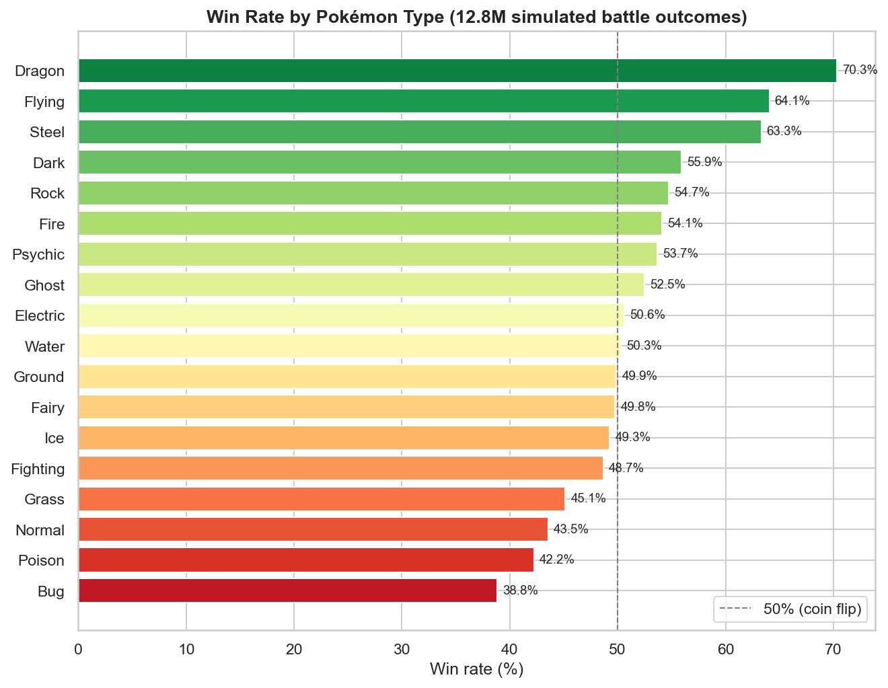
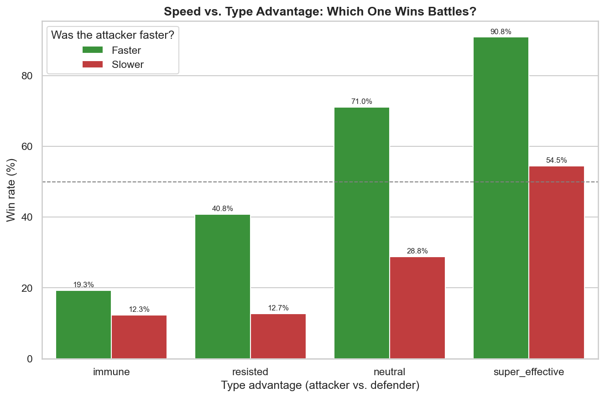
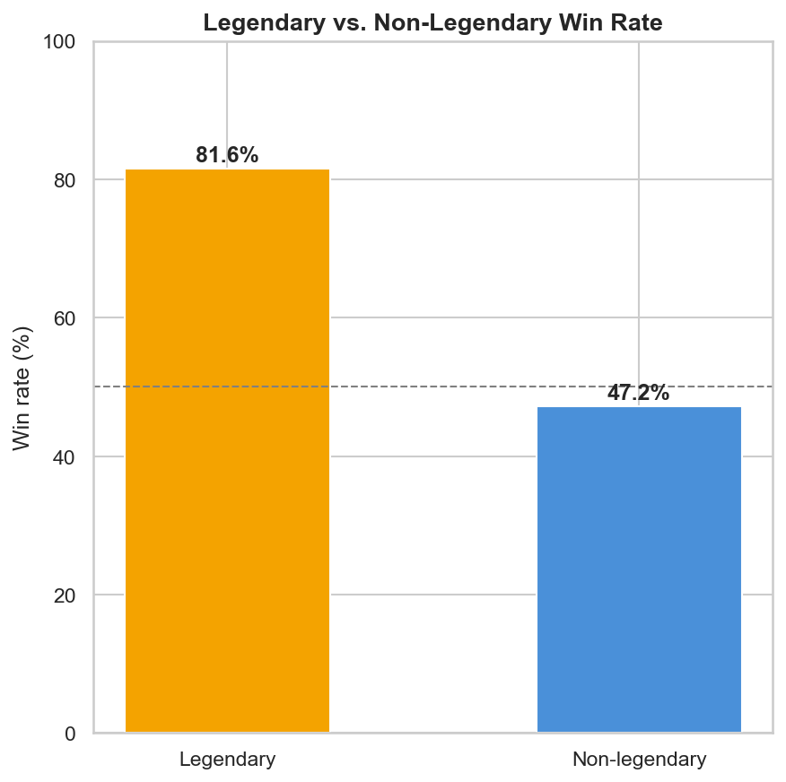
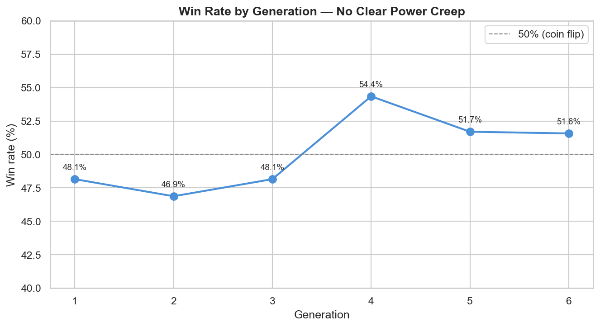
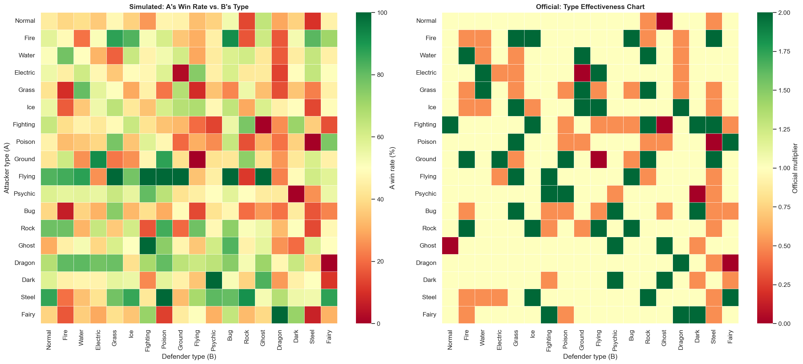
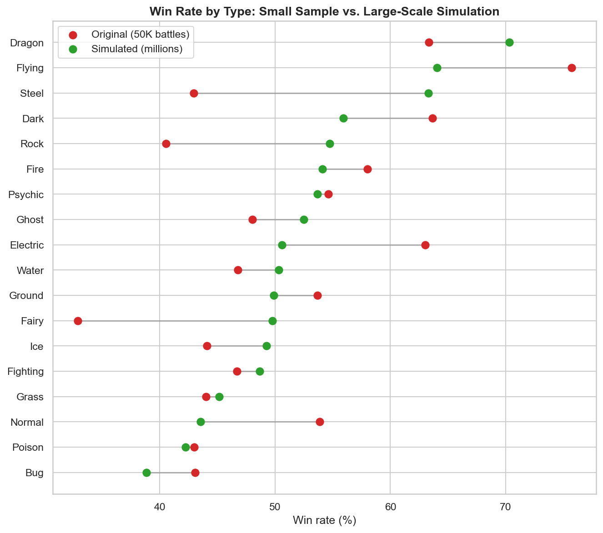

# PySpark Pokémon Battle Analytics ⚡

> A distributed ETL pipeline that simulates millions of Pokémon battles using PySpark and the game's real damage formula, then analyzes the results with a medallion architecture (Bronze → Silver → Gold).

---

## 🎯 Business Questions Answered
- Which type has the highest real win rate across all matchups (not just the theoretical type chart)?
- Does speed (who attacks first) matter more than raw stats or type advantage?
- Do legendary Pokémon actually win significantly more often, or is that a myth?
- Is there a "power creep" effect — do Pokémon from newer generations perform better in combat?
- How closely does the official type effectiveness chart match simulated battle outcomes?

---

## 📈 Key Findings

Based on **~12.8 million simulated battle outcomes** (~6.4M battles × 2 participants each) across all possible Pokémon matchups.

**Which type wins the most?**
Dragon leads decisively at **70.3% win rate**, followed by Flying (64.1%) and Steel (63.3%). Bug is the weakest at **38.8%**, followed by Poison (42.3%) and Normal (43.6%) — consistent with Dragon/Steel/Flying's few weaknesses and Bug's poor offensive/defensive profile in the real games.



**Does Speed matter more than type advantage?** Yes, decisively.

| Type advantage | Faster Pokémon wins | Slower Pokémon wins | Speed multiplier |
|---|---|---|---|
| Immune | 19.3% | 12.3% | 1.6x |
| Resisted | 40.8% | 12.7% | **3.2x** |
| Neutral | 71.0% | 28.8% | 2.5x |
| Super effective | 90.8% | 54.5% | 1.7x |

Being faster multiplies win probability by 1.6x–3.2x in every type-advantage bucket — the effect is strongest exactly when a Pokémon's type is at a disadvantage, where Speed nearly triples its odds.



**Do legendary Pokémon really win more?** Confirmed, not a myth — **81.6% win rate for legendaries vs. 47.2% for non-legendaries**.



**Is there generational power creep?** Not observed — win rates by generation range narrowly from 46.9% (Gen 2) to 54.4% (Gen 4), with no upward trend across generations.



**Does the simulation match the official type chart?** Correlation of **0.65** between simulated win rate and the official type multiplier — strong and directionally correct (all 0.0-multiplier immunities reproduced exactly, e.g. Ground vs. Flying, Psychic vs. Dark), but not perfect, because base stats also drive outcomes independent of type (e.g. Steel beat Poison 100% of the time despite a neutral 1.0 type multiplier, purely on stat advantage).



**Does simulation scale matter?** Yes — several types shifted 15–20 points between the original 50K-battle dataset and the millions-scale simulation (e.g. Fairy: 32.9% → 49.8%). Types with few original battles (like Fairy, with only 2,151) had noisy, unstable estimates; the large-scale simulation gives statistically stable win rates.



---

## 💼 Business Impact — Beyond Pokémon

This project is entertainment-themed, but every technique used transfers directly to real business problems:

- **Distributed Monte Carlo simulation** (the core of this project) is the same technique used for **risk modeling, insurance pricing, and financial forecasting** — anywhere you need to simulate thousands/millions of random scenarios to estimate a probability distribution instead of relying on a single deterministic guess.
- **Segment performance analysis** (win rate by type) mirrors identifying **underperforming product lines or customer segments** in a business — Bug-type's 38.8% win rate is structurally analogous to flagging a segment for resource reallocation or strategic review.
- **Speed vs. type advantage** (a 1.6x–3.2x win-rate multiplier from being faster) maps directly to **decision latency in business systems** — e.g., a fraud-detection system that responds in milliseconds can outperform a more "accurate" one that responds too slowly, the same way a fast but type-disadvantaged Pokémon can still win.
- **The "does simulation scale matter?" finding** (small-sample noise vs. large-scale stability) is the same statistical argument behind **why A/B tests need minimum sample sizes** before a business trusts a conclusion — the Fairy-type swing (32.9% → 49.8%) is a concrete, visual example of what happens when you decide too early.
- **Validating simulated results against the official type chart** (0.65 correlation, with explainable outliers like Steel vs. Poison) mirrors **validating a predictive model against known business rules** — when the model and the rules disagree, that disagreement is often the most valuable insight, not a bug to hide.

---

## 🏗️ Architecture

```
Kaggle CSVs (pokemon.csv, combats.csv)
      │
      ▼
 Bronze Layer          → Raw ingestion, no transformations
      │
      ▼
 Silver Layer          → Cleaning, type casting, standardization
      │
      ▼
 Battle Simulation      → PySpark-distributed Monte Carlo simulation:
 (PySpark)                every Pokémon vs. every Pokémon, using the
                          game's real damage formula, run multiple
                          times per matchup to account for crit/miss/
                          damage-roll randomness → millions of rows
      │
      ▼
  Gold Layer            → Win rates, type matchup matrix, generation
                          trends — business metrics ready for BI
      │
      ▼
 Visualization Notebook → Matplotlib/Seaborn charts answering
 (Python)                 every business question, no BI tool required
```

---

## 📊 Data Sources

| Dataset | Source |
|---|---|
| Pokémon stats (~800 Pokémon: type, base stats, generation, legendary flag) | [Kaggle — Pokemon: Weedle's Cave](https://www.kaggle.com/datasets/terminus7/pokemon-challenge) |
| Original simulated combats (~50,000 battles) | Same dataset as above (`combats.csv`) |
| Large-scale simulated combats (millions of rows) | Generated in this project via PySpark, using the games's real damage formula and type effectiveness table |

> Raw CSV files are not included in this repo. Download them manually from the link above and place them in `data/bronze/`.

---

## 🛠️ Stack

| Layer | Tools |
|---|---|
| Distributed processing | PySpark, Spark SQL |
| Environment | Conda (Python 3.10, OpenJDK 17, PySpark 3.5.1) |
| Storage | Parquet (Bronze → Silver → Gold) |
| Orchestration | Jupyter Notebooks |
| Visualization | Matplotlib, Seaborn |
| Version Control | Git, GitHub |

---

## ⚙️ How to Run Locally

### 1. Clone the repo
```bash
git clone https://github.com/Cahudisa/pyspark-pokemon-battles.git
cd pyspark-pokemon-battles
```

### 2. Create and activate the Conda environment
```bash
conda env create -f environment.yml
conda activate pyspark-pokemon-battles
```

### 3. Set up Hadoop winutils (Windows only)
PySpark needs `winutils.exe` and `hadoop.dll` to write files on Windows:

1. Download both files from [cdarlint/winutils](https://github.com/cdarlint/winutils) (folder `hadoop-3.3.5/bin/`)
2. Place them in `tools/hadoop/bin/`
3. Configure the environment variable (scoped to this Conda env only):
   ```bash
   conda env config vars set HADOOP_HOME=<full-path-to-project>\tools\hadoop -n pyspark-pokemon-battles
   ```
4. `HADOOP_HOME` alone isn't enough — `hadoop.dll` also needs to be on the PATH for the JVM to load it as a native library. Add it via a Conda activate script so it's scoped to this environment only:
   ```bash
   mkdir "%CONDA_PREFIX%\etc\conda\activate.d"
   notepad "%CONDA_PREFIX%\etc\conda\activate.d\zz_hadoop_path_activate.bat"
   ```
   Paste this content and save:
   ```bat
   @echo off
   set "PATH=%HADOOP_HOME%\bin;%PATH%"
   ```
5. Reactivate and verify:
   ```bash
   conda deactivate
   conda activate pyspark-pokemon-battles
   python test_spark.py
   ```

### 4. Download the dataset
Download `pokemon.csv` and `combats.csv` from Kaggle and place them in `data/bronze/`.

### 5. Run the notebooks in order
```
01_bronze_ingest.ipynb        → raw ingestion
02_silver_transform.ipynb     → cleaning and standardization
03_battle_simulation.ipynb    → distributed Monte Carlo battle simulation
04_gold_metrics.ipynb         → business metrics
05_visualization.ipynb        → charts answering every business question
```

---

## 👤 Author
**Carlos Díaz** — Data Engineer
[GitHub](https://github.com/Cahudisa)
